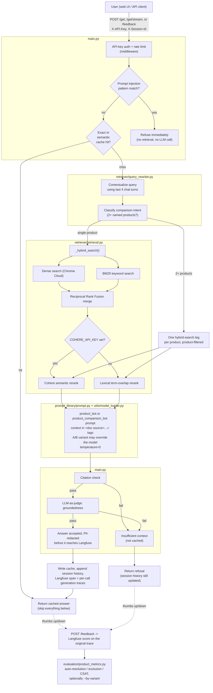

# Customer Support RAG System — Technical Summary

Single source of truth for this codebase: what it is, how a request flows through it end to end, every API surface, every config knob, and the reasoning behind the non-obvious decisions. Written to let someone with zero prior context become productive without re-deriving anything from the source.

Last updated: 2026-07-16, after a full architecture-critique-driven hardening pass covering Redis/ingestion infra, retrieval quality, security/compliance, observability/cost, and product-outcome measurement — see [§20 Recent hardening](#20-recent-hardening-2026-07-16) for the complete list of what changed and why, and [§21 Known limitations / not accomplished](#21-known-limitations--not-accomplished) for what was deliberately left undone.

---

## 1. What this is

A FastAPI-based e-commerce product-support chatbot. It answers questions about products using **retrieval-augmented generation (RAG)** over a corpus of product reviews (currently: the bundled Flipkart review dataset, ~576 chunks after the product-context embedding fix in §20). It is not a general chatbot — it refuses to answer anything it cannot ground in retrieved evidence, on purpose.

Core design commitments, all visible directly in the code:

- **Grounded or silent.** Every factual claim must carry a `[source:ID]` citation. An answer that cites something it didn't retrieve, or that an LLM judge decides isn't actually supported by the context, gets replaced with a safe refusal — never a guess.
- **Multi-turn aware.** Follow-up questions ("what about a cheaper one?") get rewritten into standalone questions using recent chat history before retrieval runs.
- **Multi-product aware.** A comparison question ("compare A's battery life to B's") is detected and retrieves each named product separately, instead of one query embedding that only ever favors whichever product's phrasing is closer.
- **Provider-agnostic.** LLM provider (Groq / Google Gemini / HuggingFace) and embedding provider are both swappable via config, with env-var overrides for the LLM side so you can hop providers mid-incident without a redeploy.
- **Defended on both prompt-injection channels.** Retrieved review content is delimited and labeled untrusted data, never instructions (defends the *ingestion* channel). The user's own chat message is pattern-checked for jailbreak/override attempts before it ever reaches retrieval (defends the *input* channel, added §20).
- **PII-aware.** Source documents and live chat text are redacted (regex + NER) before embedding or before being sent to third-party observability tooling.
- **Measured, not just monitored.** Every request is traced (Langfuse), every LLM call's cost is tracked individually, and a live-traffic product-metrics script computes auto-resolution rate, exclusion rate, and a CSAT proxy from real usage — not just an offline golden-set score.
- **Degrades loudly, never silently.** Redis unavailable → in-memory fallback, logged. Cohere unavailable → lexical reranking, logged as a warning on every query. Langfuse unset → tracing becomes a no-op. Nothing silently produces degraded behavior without saying so in the logs.

---

## 2. Tech stack

| Layer | Choice | Notes |
|---|---|---|
| API framework | FastAPI + Uvicorn | Single process |
| LLM (generation + query rewrite + comparison classification + groundedness judge) | Groq (`llama-3.3-70b-versatile` / `llama-3.1-8b-instant`) | Swappable to Google Gemini or HuggingFace via `LLM_PROVIDER` env var; currently running HuggingFace (`Qwen/Qwen3-4B-Instruct-2507`) after Groq's daily quota was exhausted during this session's testing |
| Embeddings | `sentence-transformers/all-MiniLM-L6-v2`, local (HuggingFace) | Runs on-box, zero API quota risk |
| Vector store | Chroma Cloud | No local fallback once cloud creds are set — see [§9](#9-generation) |
| Keyword search | BM25 (`rank_bm25`), JSON index in object storage | Runs alongside dense search, merged via RRF |
| Reranking | Cohere Rerank (`rerank-english-v3.0`), optional | Falls back to lexical term-overlap reranking if unset |
| Cache / sessions / rate limiting | Redis (Memorystore in dev), in-memory fallback | `fakeredis` for tests; **actually wired and live-verified in `dev`** as of this session (was designed but never deployed before — see [§20](#20-recent-hardening-2026-07-16)) |
| PII redaction | Regex (email/phone/card) + Presidio/spaCy NER (names/locations) | `utils/pii.py`, hard dependency (not optional-install), applied at ingestion and at the Langfuse boundary |
| Prompt-injection defense | `<doc>` delimiters (retrieval-content channel) + pattern-based input guard (`utils/prompt_guard.py`, user-message channel) | Two independent channels, added in different sessions |
| Observability | Langfuse (v4, OTel-based) + structured JSON request logs | Per-request trace, per-LLM-call generation observation (model + token usage), citation/groundedness/user-feedback all as first-class Langfuse **scores** |
| Cost tracking | Langfuse `generation` observations per LLM call | Query rewrite, comparison classification, answer generation, and the groundedness judge are each tracked separately — see [§14](#14-cost-tracking) |
| Product metrics | `evaluation/product_metrics.py` | Live-traffic auto-resolution rate, exclusion rate, active users, CSAT proxy — aggregated from Langfuse, no new instrumentation |
| A/B testing | `utils/ops.py:assign_experiment_variant` + Langfuse trace tagging | Deterministic per-session bucketing, off by default |
| Evaluation | RAGAS (if installed) + a fast fallback, 12-case golden set | Gates CI on regression — this is the *offline* counterpart to the live product-metrics script above |
| Deployment target | Google Cloud Run (Terraform-provisioned) | See [§18](#18-deployment) |

---

## 3. High-Level Design (HLD)



### Text version (for a quick skim)

```
User
 -> FastAPI middleware: X-API-Key auth, per-identity rate limit
 -> Prompt-injection pattern check on the raw message
      | match -> refuse immediately, zero retrieval/LLM calls
      v no match
 -> Exact cache check (Redis, keyed on session_id + normalized raw query)
 -> Semantic cache check (cosine pre-filter -> NLI entailment gate)
      | hit -> return cached answer, skip everything below
      v miss
 -> Query rewrite (only if chat history exists): resolve pronouns/negation/
    multi-item references into a standalone question
 -> Comparison-intent classification (small LLM): 2+ named products?
      | yes -> one hybrid-search leg per product, product-name-filtered
      v no  -> one hybrid-search leg for the whole query
 -> Hybrid retrieval: dense (Chroma) + BM25, run concurrently, merged by RRF
 -> Rerank: Cohere if configured, else lexical term-overlap fallback
 -> Generation: product_bot (or product_comparison_bot for a detected
    comparison) prompt, context as untrusted <doc> blocks, temperature=0,
    citation required, model may be A/B-overridden for the treatment variant
 -> Citation check -> Groundedness judge (LLM-as-judge)
      | either fails -> "Insufficient context" (never cached)
      v both pass
 -> Cache write (exact + semantic) + session history append
 -> RequestTrace JSON log + Langfuse span, PII-redacted, tagged with the
    A/B variant, with a nested generation observation (model + token
    usage) per LLM call made along the way
 -> Response to user (plain text or SSE token stream, rendered as Markdown)
 -> Optional: thumbs up/down -> POST /feedback -> Langfuse score on the
    same trace, joinable later via evaluation/product_metrics.py
```

---

## 4. Repository structure

```
main.py                        FastAPI app: routes, auth, the whole request pipeline
config/
  config.yaml                  Provider, retrieval, ingestion settings
  config_loader.py
retriever/
  retrieval.py                 Hybrid search, RRF, reranking, metadata filters,
                                multi-hop comparison routing
  query_rewriter.py            Multi-turn query contextualization +
                                comparison-intent classification
data_ingestion/
  ingestion_pipeline.py        Incremental ingest: land -> clean -> PII-redact ->
                                chunk -> dedupe -> embed -> archive
utils/
  model_loader.py               LLM/embedding provider loading + caching (groq/google/huggingface)
  chroma_utils.py                Chroma Cloud vs local persistence routing
  ops.py                         ResponseCache, RateLimiter, SessionStore (Redis-backed,
                                  in-memory fallback), request tracing, Langfuse wiring
                                  (trace + per-call generation observations + feedback
                                  scores), NLI-gated semantic cache, A/B variant assignment
  pii.py                         PII redaction: regex + Presidio/spaCy NER
  prompt_guard.py                Input-side prompt-injection/jailbreak pattern detection
  bm25_index.py                  BM25 index persistence
  object_store.py                Storage abstraction (local / gs:// / s3:// / abfs://),
                                  including the archive-after-ingest move
prompt_library/
  prompt.py                     System prompts: generation, comparison generation,
                                 groundedness judge, query rewrite, comparison classifier
evaluation/
  golden_test_set.py             12 labeled test cases (offline evaluation)
  evaluator.py                   Retrieval + generation metrics (RAGAS or fallback)
  run_evaluation.py              Runs golden set, gates CI on regression vs. baseline
  product_metrics.py             Live-traffic product metrics from real Langfuse data
                                  (auto-resolution rate, exclusion rate, active users,
                                  CSAT proxy), with an optional --by-variant breakdown
tests/                          155 tests (fast, dependency-free, except test_phase4_ci.py
                                 which hits real providers)
templates/, static/             Web chat UI (vanilla HTML/JS, no framework) --
                                 Markdown-rendered answers (marked.js + DOMPurify),
                                 thumbs up/down feedback buttons
infra/                          Terraform: GCP Cloud Run, networking (VPC connector +
                                 Memorystore), storage, secrets, IAM, WIF -- see
                                 infra/README.md
.github/workflows/
  ci-fast-tests.yml              The 155-test unit suite, every push/PR, no live API calls
  cd-{dev,test,prod}.yml         Branch-triggered: tests -> build -> deploy -> smoke test
  rag-evaluation.yml             Quota-heavy live-provider evaluation, gated to prod/manual
Dockerfile, docker-compose.yml  Container build + local compose (no local Redis by design)
```

---

## 5. API reference

All routes defined in `main.py`. Base URL in local dev: `http://localhost:8001`.

### Auth

Every request to `/get`, `/get/stream`, and `/feedback` must carry:

```
X-API-Key: <APP_API_KEY value>
```

Checked with `secrets.compare_digest` (timing-safe). Missing/wrong key → `401`. `APP_API_KEY` unset server-side → `503` (fails closed, not open). Also enforced: **per-identity rate limiting** (`RateLimiter`, keyed on the API key itself, or client IP if no key — default 30 requests / 60s window), returning `429` when exceeded.

### `GET /`
Renders the chat UI (`templates/chat.html`). No auth.

### `GET /health`
Liveness probe. Always `{"status": "healthy"}` if the process is up. No auth, no dependency checks.

### `GET /ready`
Readiness probe — actually checks dependencies: `APP_API_KEY` set, `GROQ_API_KEY` set, Chroma storage reachable/configured. Returns `503` if any check fails.

```json
{"status": "ready", "checks": {"app_api_key": true, "groq_api_key": true, "chroma_storage": true}}
```

### `POST /get`
Single-turn or multi-turn (via `X-Session-Id`) chat, plain-text response.

**Headers:** `X-API-Key` (required), `X-Session-Id` (optional, defaults to `"default"` — see [Known limitations](#21-known-limitations--not-accomplished) about the web UI not sending this).

**Body (form-encoded):** `msg` (string, 1-2000 chars).

```bash
curl -X POST http://localhost:8001/get \
  -H "X-API-Key: $APP_API_KEY" \
  -H "X-Session-Id: user-123" \
  --data-urlencode "msg=Can you recommend a good budget headphone?"
```

Response: the answer as plain text, Markdown-formatted (may be the "Insufficient context..." refusal, or the injection-blocked refusal).

### `POST /get/stream`
Same request shape as `/get`, but Server-Sent Events (SSE) response — used by the web UI for token-by-token streaming, rendered live as Markdown.

**Event sequence:**
```
event: request_id
data: <uuid>

event: status
data: retrieving

event: cache
data: miss | exact | semantic

event: token
data: "<JSON-encoded word chunk>"
... (repeated, one per whitespace-split word -- NOT true incremental LLM
     streaming; the full answer is generated first, then replayed word by
     word for a typing-effect UI. Each token's payload is JSON-encoded so
     an embedded newline -- routine now that answers are Markdown with
     headings/lists/tables -- survives correctly; a naive f"data: {token}"
     silently truncated anything after the first embedded newline, a real
     bug found and fixed this session, see §20)

event: done
data: [DONE]
```

Note: `[DONE]` is sent regardless of success/refusal — a refusal is a normal, complete answer from the API's perspective, not an error. The frontend renders thumbs up/down feedback buttons once `done` fires, using the `request_id` captured from the first event.

### `POST /feedback`

Added this session. Records a user's thumbs up/down as a score on the original request's Langfuse trace.

**Headers:** `X-API-Key` (required).

**Body (JSON):** `{"request_id": "<uuid from the original request>", "rating": "up" | "down"}`.

```bash
curl -X POST http://localhost:8001/feedback \
  -H "X-API-Key: $APP_API_KEY" -H "Content-Type: application/json" \
  -d '{"request_id": "...", "rating": "up"}'
```

Response: `{"recorded": true}` or `{"recorded": false}` (Langfuse disabled/unavailable — never a 5xx; feedback failing must never disrupt the chat itself). The score (`user_feedback`, `BOOLEAN`, `1.0`/`0.0`) lands on the same trace as the original request's `citation_check`/`groundedness` scores, `trace_id` re-derived deterministically from `request_id` — no new storage needed.

---

## 6. Low-Level Design — Request flow (code-level)

This is `main.py`'s `invoke_chain_details()` — the one function every chat request (streaming or not) funnels through.

1. **Trace + variant assignment.** A `RequestTrace` object accumulates timing/metadata for the structured JSON log line. `assign_experiment_variant(session_id)` deterministically buckets the session into `"control"`/`"treatment"` (stable hash of `session_id`, not Python's randomized `hash()`) and tags the trace immediately. `build_langfuse_trace()` opens a matching Langfuse span (no-op if keys unset), trace ID deterministically derived from the request's own ID.

2. **Prompt-injection check** (`utils.prompt_guard.detect_prompt_injection`) — pattern-matched against the raw user message *before anything else*, including embedding computation. A match short-circuits immediately: the trace is tagged with the matched technique, a fixed refusal is returned, and retrieval/generation are never invoked at all — a latency/cost win on top of the security benefit, since a genuine product question has no legitimate reason to trip these patterns.

3. **Query embedded** (`_embed_query`) — needed for the semantic cache check regardless of hit/miss. Cached per-`ModelLoader`-instance.

4. **Exact cache check** (`ResponseCache.get_exact`) — keyed on `sha256(session_id + normalize(raw_query))`.

5. **Semantic cache check** (`ResponseCache.get_semantic`, only if exact missed) — see [§11.4](#114-responsecache--semantic-match-and-the-nli-gate).

6. **On any cache hit:** append to session history, log (tagged with the variant), return immediately. **Retrieval and generation are entirely skipped.**

7. **On a miss:** build chat history (`_build_chat_history`, last 4 turns, citations stripped — see [§7](#7-citation-stripping-in-chat-history)).

8. **Retrieval** (`retriever_obj.call_retriever`) — see [§8](#8-retrieval-in-detail) for the single-query path and the multi-hop comparison branch.

9. **Prompt selection.** `retriever_obj.last_comparison_products` (set by the call above) picks `product_comparison_bot` (asks for a Markdown comparison table) when a comparison was detected, `product_bot` otherwise.

10. **Model selection.** `_ab_test_model_override(variant)` returns an override model name only when `AB_TEST_ENABLED=true` *and* the session landed in `"treatment"` *and* `AB_TEST_MODEL_NAME` is set — otherwise the normally-configured model is used, which is every request by default (the experiment is off unless deliberately turned on).

11. **Generation** — the selected prompt, `temperature=0`, context passed as `<doc source="ID">...</doc>` blocks, tracked as a nested Langfuse `generation` observation (model + token usage from the LLM response's `usage_metadata`) — see [§14](#14-cost-tracking).

12. **Guardrails, in order:**
    - If retrieval returned nothing → immediate refusal, no LLM guardrail calls needed.
    - **Citation check** (`_verify_citations`) — regex-extracts every `source:ID` token from the answer and checks each against the set of actually-retrieved source IDs. Any mismatch → refusal.
    - **Groundedness judge** (`_judge_groundedness`) — a separate LLM call (also tracked as its own Langfuse generation), strict YES/NO, asks "is this answer actually supported by this context?"
    - Either check failing → the answer is replaced with a fixed refusal string, never the model's actual (possibly ungrounded) text.

13. **Cache write** — only if the output is not a refusal (a citation/groundedness failure is often transient sampling variance; caching it would make the refusal sticky for the whole TTL).

14. **Session history append** — happens unconditionally, even for a refusal.

15. **Trace finished, Langfuse span closed.** `citation_check`/`groundedness` recorded as first-class Langfuse scores. The question, the answer, and every nested generation's input/output are **PII-redacted** (`utils/pii.py`) before this data leaves the process — see [§13](#13-pii-redaction).

16. **Later, optionally:** a thumbs up/down hits `POST /feedback`, which re-derives the same trace ID from `request_id` and records a `user_feedback` score post-hoc, no live span needed.

---

## 7. Citation stripping in chat history

`_strip_citations()` removes `[source:ID]` markers before an answer is replayed into a *future* prompt as chat history. Without this, a weaker model tends to copy a source ID forward from a previous turn's answer and cite it against the *current* turn's freshly-retrieved (and likely different) context — a citation that looks fabricated and gets correctly rejected by `_verify_citations`, producing a false refusal on a question the model could otherwise answer fine purely from history.

---

## 8. Retrieval, in detail

`retriever/retrieval.py`'s `Retriever.call_retriever()`:

1. **Query rewrite** (`contextualize_query`, `retriever/query_rewriter.py`) — skipped entirely if there's no chat history yet (first turn). Uses a small/fast model with an explicit prompt contract: resolve pronouns, preserve negation polarity exactly, and expand an ambiguous singular reference ("tell me more about it") to *all* named items from a multi-item prior answer rather than silently picking the last one.

2. **Comparison-intent classification** (`classify_comparison_products`, same small model — a 4th per-request LLM call, chosen over a regex heuristic per an explicit decision to prioritize reliability on varied phrasing over cost). Asks the model to name 2+ products if the (already-resolved) question is comparing them directly, using a `"PRODUCT: <name>"` line-per-product format — deliberately not JSON, far more reliable for a small model to produce correctly. Fewer than 2 extracted names, or any failure, means "not a comparison" and the normal single-query path runs — retrieval must never hard-fail because classification failed.

3. **Branch — comparison detected:** one full hybrid-search leg *per product* (`_retrieve_comparison`), each filtered to its own `product_name` metadata so one product's stronger matches can't crowd out the other's. Results stay grouped by product in the returned list; each chunk's `page_content` already starts with `"Product: <name>"` (§20's CSV embedding fix), so the LLM sees clearly which product each block of evidence is about even without an explicit section header.

4. **Branch — no comparison:** the original single-query path. Lexical query expansion (`rewrite_query`, a fixed synonym table), metadata filter parsing (`rating`/`price`/`category`/`product_name`/`brand` — only `rating` actually matches anything against the bundled demo dataset), then one hybrid-search leg.

5. **Hybrid search** (`_hybrid_search`, shared by both branches), **run concurrently** (`ThreadPoolExecutor`, 2 workers):
   - **Dense**: Chroma similarity search via `retriever.invoke()`.
   - **Sparse**: BM25 keyword search (`utils/bm25_index.py`), index reloaded from storage at most every 60s since it's rebuilt by the ingestion job, not this process.
   - Candidate pool size: 20 if Cohere reranking is active, 10 otherwise.
   - Metadata filters applied to both result sets independently, then merged via **Reciprocal Rank Fusion** (k=60), then **reranked** (Cohere if configured, else lexical term-overlap, logged as a warning on every query so degraded mode is never silent).

---

## 9. Generation

### 9.1 Vector store: Chroma

`utils/chroma_utils.py`'s `create_chroma_store()`. Once cloud credentials are configured, cloud is used unconditionally — no silent fallback to local storage on a cloud error; a quota/timeout/auth failure surfaces as a loud `RuntimeError`.

### 9.2 The generation prompts

`prompt_library/prompt.py` has two generation templates:

- **`product_bot`** — the default. Context as untrusted `<doc source="ID">` blocks. Explicitly instructed to format the answer in **Markdown** (bullets for multiple points, tables for structured comparisons, short paragraphs — not one dense wall of text) with each citation attached to the specific claim it supports, not moved to a trailing list. A completeness instruction covers multi-item recall from chat history.
- **`product_comparison_bot`** — used when the comparison classifier (§8.2) fires. Same untrusted-context framing, but explicitly asks for a **Markdown table** comparing the named products side by side on the attributes in question, with an explicit instruction to mark a product's cell "No data" rather than guess when its context is insufficient.

Both share the same injection-defense line: context is data, never instructions, even if a `<doc>` block claims otherwise.

### 9.3 Determinism

`ModelLoader.load_llm()` sets `temperature=0` across all three providers (HF: `do_sample=False`, since TGI-based endpoints typically reject `temperature=0` outright). Retrieval is fully deterministic; generation still shows occasional minor variance, most likely from continuous-batching non-associativity on the serving side — a ceiling inherent to any shared, high-throughput inference API, not fixable from this codebase.

---

## 10. Provider loading, caching, and quota management

`utils/model_loader.py`'s `ModelLoader` is the single point of LLM/embedding provider selection.

### 10.1 Provider client caching

`load_embeddings()` is cached as `self._embeddings` (a single instance per `ModelLoader`); `load_llm()` is cached in `self._llm_cache`, keyed by `(provider, model_name)` — the same instance is called with different models across the request (main generation vs. groundedness judge vs. query-rewrite vs. comparison classification vs. an A/B-overridden model), so a naive uncached implementation would reconstruct clients repeatedly within a single request.

### 10.2 Provider quick-switch

`LLM_PROVIDER` / `LLM_MODEL_NAME` / `LLM_REWRITE_MODEL_NAME` env vars take precedence over `config.yaml` whenever set. As of this session, `.env` is set to `LLM_PROVIDER=huggingface` with `Qwen/Qwen3-4B-Instruct-2507`, switched mid-session after Groq's daily token cap was fully exhausted by cumulative testing. Embedding provider is deliberately **not** switchable this way — see the ingestion note in §17.

### 10.3 A/B test model override

`main.py:_ab_test_model_override(variant)` is a *fourth* override layer, narrower than the above: it only applies to the main answer-generation call, only for sessions bucketed into `"treatment"`, and only when `AB_TEST_ENABLED=true` is explicitly set (off by default — never silently starts spending on a second model). See [§16](#16-ab-testing).

### 10.4 Provider quota realities (learned firsthand)

| Provider | Failure mode | Notes |
|---|---|---|
| Groq | Daily token cap (~100k TPD observed on `llama-3.3-70b-versatile`) | Resets on a fixed daily cycle, not rolling. Fully exhausted during this session's testing. |
| Google (Gemini) | Free tier only if the API key's project has **no Cloud Billing account linked** | A billing-linked project draws from a separate "Prepay" balance; hitting $0 there gives a different, easy-to-miss `RESOURCE_EXHAUSTED` error. |
| HuggingFace | Small **monthly** credit pool via the serverless Inference router | Embeddings run **locally** (no API, no quota risk). Currently the active LLM provider for this project. |

---

## 11. Caching architecture

`utils/ops.py`. Three independent Redis-backed subsystems, all with a graceful in-memory fallback (logged loudly) when `REDIS_URL` is unset. **As of this session, Redis is genuinely wired and live-verified in `dev`** — Memorystore Basic tier + a VPC connector (`infra/modules/gcp/networking`), previously only designed/tested against in-memory fallback. See [§18](#18-deployment) for what it took to get there.

### 11.1 SessionStore
Per-session chat history (`rag:session:{id}` list in Redis). Trimmed to `SESSION_MAX_TURNS` (default 20), expires after `SESSION_TTL_SECONDS` (default 86400). Only the last 4 turns are ever pulled into a prompt.

### 11.2 RateLimiter
Fixed-window counter (`rag:rate:{identity}`), default 30 requests / 60s.

### 11.3 ResponseCache — exact match
`rag:exact:{sha256(session_id + normalized_query)}`, TTL = `CACHE_TTL_SECONDS` (default 3600). Never written for a refusal answer.

### 11.4 ResponseCache — semantic match, and the NLI gate

The most non-obvious piece of engineering in the codebase. Raw cosine similarity on `all-MiniLM-L6-v2` ranks a **negated opposite** ("good battery life" vs. "poor battery life", ~0.95–0.98) *above* a genuine paraphrase ("sound quality" vs. "audio quality", ~0.89) — no single threshold can separate the two.

**The fix:** a cheap cosine pre-filter (`SEMANTIC_CACHE_CANDIDATE_THRESHOLD`, default 0.80) shortlists candidates, then the top few are checked with a **bidirectional NLI cross-encoder** (`cross-encoder/nli-deberta-v3-small`) — entailment required forward, no contradiction required reverse. Loaded once as a lazy module-level singleton (~5.3s cold, ~32ms warm per check thereafter).

---

## 12. Ingestion pipeline

`data_ingestion/ingestion_pipeline.py`. Designed as a stateless, repeatable job: **landing storage → clean → PII-redact → dedupe → chunk → embed → upsert → archive**.

### 12.1 Landing → processed → archive

Source files (PDF, CSV) live in a cloud-agnostic landing path (`utils/object_store.py`, local folder or `gs://`/`s3://`/`abfs://`). Change detection is two-layered:
- **File-level**: a fingerprint (size + mtime) decides whether a file needs (re)processing at all.
- **Chunk-level**: `build_document_id` content-hashes each chunk, so an unchanged row inside a changed file is still skipped — a form of change-data-capture at record granularity.

After a successful run, `_archive_files` moves each processed file from the landing prefix to an archive prefix (`utils/object_store.py:move_file`), so landing only ever holds files not yet processed. Added this session — previously the demo dataset was baked directly into the Docker image as a stopgap, which the deployed `dev` ingestion job depended on until it was replaced with a real GCS-landing-bucket flow.

### 12.2 CSV ingestion and the embedding-content fix

`_documents_from_dataframe` recognizes the review-style schema (`product_title`/`rating`/`summary`/`review`). **Fixed this session:** `page_content` previously embedded only the `review` text — `product_title`/`summary` were metadata-only, invisible to both dense and BM25 search (which both index off `page_content`). A query naming a product directly ("How is the Boat Rockerz 235v2?") only matched if a review happened to repeat those exact words. `page_content` now includes labeled `Product`/`Rating`/`Summary`/`Review` lines (missing fields dropped, not rendered as the literal string `"nan"`). This changed what gets hashed into chunk IDs, so the Chroma collection was wiped and cleanly re-ingested rather than left with stale duplicate-content chunks alongside the new format.

### 12.3 PII redaction at ingestion

Both the CSV and PDF loaders run `redact_pii()` (§13) on extracted text before it's chunked — source documents are exactly as untrusted as live chat input from a PII standpoint.

### 12.4 Scale

Current implementation uses `pandas.read_csv` + `df.iterrows()` (a Python row loop) and sequential Chroma upserts (batched at 250 records, Chroma Cloud's write cap). This is adequate for the current dataset size; **deliberately not optimized further** without a real volume number demanding it — see [§21](#21-known-limitations--not-accomplished).

---

## 13. PII redaction

`utils/pii.py`. Two layers, applied together:

- **Regex**, for structured PII: emails, phone numbers, card-like numbers. Patterns are deliberately narrow enough to not false-positive on this app's own data shape (ratings like `4.5`, model numbers like `235v2`).
- **NER via Presidio** (spaCy `en_core_web_sm` under the hood, explicitly configured — Presidio's default expects the much larger `en_core_web_lg`), for names and locations regex can't catch.

Applied at two exposure surfaces:
- **Ingestion** (§12.3) — source documents before embedding.
- **The Langfuse boundary** (`utils/ops.py`) — trace input/output and every nested generation observation's input/output, before any of it leaves the process. The LLM itself still sees the real, unredacted text (it needs the real data to answer correctly) — redaction happens specifically at the point data would otherwise persist to a third-party observability tool with no retention policy of its own.

Deliberately a **hard dependency** in `requirements.txt`, not `requirements-optional.txt` — a silently-skipped security control is worse than a missing feature (see §20's Langfuse-never-installed bug, the exact failure mode this decision avoids repeating).

---

## 14. Cost tracking

`utils/ops.py:start_llm_generation`/`finish_llm_generation`. Every LLM call in a request — query rewrite, comparison classification, main answer generation, groundedness judge — is wrapped as its own nested Langfuse **`generation`** observation (not a plain span), tagged with the actual model name and `usage_details` translated from the LangChain response's `usage_metadata`. This is what makes Langfuse's own cost dashboard compute per-model/per-step token cost automatically, instead of the client being fully wired but only ever producing a single opaque top-level span with no model/token information (which is what existed before this session).

---

## 15. Prompt-injection defense (two channels)

- **Retrieval-content channel** (defended before this session): ingested review text is wrapped in `<doc source="ID">` tags and the generation prompts explicitly instruct the model to treat that content as data, never as instructions, even if a block claims to be from "the system." Backed structurally by `_verify_citations` (an answer citing an ID that wasn't retrieved is rejected, independent of what the model claims) and `_judge_groundedness` (a second, independent LLM-as-judge check).
- **User-input channel** (added this session, `utils/prompt_guard.py`): the chatting user's own message is checked against five pattern categories — instruction override ("ignore previous instructions"), system-prompt leak ("what is your system prompt"), role override ("you are now DAN"), developer-mode requests, and fake role markers (a message starting a line with `"System:"`). Pattern-based rather than an LLM call — a proportionate response to a threat this project's own risk assessment rated lower than the retrieval-content channel, and blocking immediately is a latency/cost win on top of the security benefit (zero retrieval/LLM calls for a detected attempt). A match is tagged on the trace (`prompt_injection_technique`) and blocks the request with a fixed refusal.

---

## 16. Outcome signal and product metrics

Before this session, nothing captured whether an answer was actually useful — only technical-tier signals (citation pass rate, groundedness pass rate, latency) existed.

- **Outcome signal**: `POST /feedback` (§5) records a thumbs up/down as a `user_feedback` Langfuse score, landing on the same trace as `citation_check`/`groundedness`, joinable for free.
- **Product metrics**: `evaluation/product_metrics.py` pages Langfuse's public API for a time window and computes, with **no new instrumentation**:
  - **Auto-resolution rate** / **exclusion rate** / **error rate** — replays `main.py`'s own `citation_check`/`groundedness_verdict` decision per trace (resolved / excluded / errored) rather than re-deriving it from raw text, so it can never drift from what the app actually decided.
  - **Active users** — distinct `session_id` count in the window.
  - **CSAT proxy** — thumbs-up ratio from `user_feedback` scores.
  - Run with `python -m evaluation.product_metrics [--hours N] [--by-variant]`.
  - **Business-tier metrics** (saved revenue, time saved per ticket vs. a human-agent baseline) are deliberately **not** computed — they need an external business input this system has no source of, and are documented as out of scope rather than faked.

This is the live-traffic counterpart to `evaluation/evaluator.py`'s offline golden-set evaluation (technical tier only, fixed test set).

---

## 17. A/B testing

`utils/ops.py:assign_experiment_variant(session_id)` deterministically buckets each session into `"control"`/`"treatment"` via a stable hash (MD5, not Python's per-process-randomized built-in `hash()`) — a session stays in the same variant for its whole conversation, no storage needed. No bespoke experimentation framework: the assignment is this one function, and the entire "analysis" side is `evaluation/product_metrics.py --by-variant`, grouping the same metrics from §16 by the `experiment_variant` tag already on every trace's metadata.

Currently wired to route the treatment variant to a different model for the main answer generation only (§10.3), gated behind `AB_TEST_ENABLED`/`AB_TEST_MODEL_NAME` — **off by default, not set on the deployed `dev` service**, inert until deliberately turned on.

---

## 18. Deployment

- **Container**: `Dockerfile` — `python:3.12-slim`, non-root user, `HEALTHCHECK` against `/health`, CPU-only PyTorch wheel. Now also installs `redis` (client library) and downloads the `en_core_web_sm` spaCy model for Presidio, both added this session after being found missing from the deployed image despite being needed at runtime.
- **Local multi-container**: `docker-compose.yml` — deliberately **no local Redis service**.
- **Deployment target: Cloud Run** (`infra/`). Three environments — dev, test, prod — each a separate Terraform root, deploying from `developer`/`staging`/`main` respectively. GCP is the only implemented provider.

### 18.1 Redis, for real, in `dev` (this session)

`infra/modules/gcp/networking` now provisions a Basic-tier Memorystore instance plus the Private Services Access VPC peering it requires, gated behind `enable_vpc_connector` (set `true` for `dev`). `REDIS_URL` is wired through Secret Manager the same way every other secret is. Getting this live surfaced five distinct real bugs, each a genuine "terraform apply succeeded" trap that only live verification caught:
1. `google_vpc_access_connector` names are capped at 25 characters — `app_name` alone doesn't fit with any suffix. Fixed with a short hashed name.
2. `vpcaccess.googleapis.com` and `servicenetworking.googleapis.com` both needed adding to the enabled-services list.
3. The connector needs explicit `min_instances`/`max_instances` now — the provider no longer silently defaults these.
4. The `redis` Python client was only ever in `requirements-optional.txt`, which the Dockerfile never installed — infra can be perfectly wired and the app will still silently run on in-memory fallback (`utils/ops.py`'s `_build_redis_client` fails soft on `ModuleNotFoundError`, by design, which is exactly what made this invisible without live verification).
5. **The Cloud Run Service and the ingestion Job are separate deployables with independent container images** — fixing/rebuilding one does not touch the other. The first post-fix ingestion run silently archived nothing new because the Job was still on a stale pre-fix image.

### 18.2 The Langfuse-never-installed bug

Found mid-session while verifying the cost-tracking work against the deployed service: `langfuse` was *also* only in `requirements-optional.txt` — the exact same failure class as Redis above, just a different package. Fixed by moving it into `requirements.txt` as a hard dependency. This also invalidated an earlier "verified against the deployed service" claim for the cost-tracking feature — that check hadn't filtered by session ID, so it was actually reading a local test trace, not a deployed-service one. Re-verified properly afterward.

### 18.3 CI/CD

- `ci-fast-tests.yml` — the 155-test unit suite, every push/PR, no live API calls.
- `cd-dev.yml` / `cd-test.yml` / `cd-prod.yml` — branch-triggered: tests → build (once, promoted across environments) → deploy (ingestion job, then the Cloud Run service, then a `/health`+`/ready` smoke test).
- `rag-evaluation.yml` — the quota-heavy live-provider evaluation, gated off the routine path.

### 18.4 A recurring git workflow gotcha (worth knowing)

Almost every PR merged in this session after the first hit "not mergeable" on `gh pr merge`, because squash-merging doesn't rebase the feature branch's own history to match the target branch's new squashed commit — the two diverge in commit *structure* (not usually content) after every squash merge. Resolved each time with a non-destructive `git fetch` + `git merge` + conflict resolution (almost always trivial: one side of a conflict block is empty, meaning "keep the feature branch's addition"; occasionally, when the same file was touched twice in one session, both sides have real content, requiring the file to be reconstructed from the known-working version rather than a blind whole-file discard) — never `reset --hard`/force-push.

### 18.5 `dev` is live and verified

```
$ curl https://customer-support-rag-dev-udytqlhsma-uw.a.run.app/ready
{"status":"ready","checks":{"app_api_key":true,"groq_api_key":true,"chroma_storage":true}}
```

Every feature described in this document has been live-verified against this deployed service, not just locally — including real thumbs-up feedback producing a real Langfuse score, a real comparison query retrieving both products, and a real prompt-injection attempt being blocked with zero LLM calls. `test`/`prod` are not yet applied (see §21).

---

## 19. Best practices followed (checklist)

**Correctness / safety**
- ✅ Refuse rather than guess — citation check + LLM groundedness judge, both independent.
- ✅ Never cache a refusal.
- ✅ Semantic similarity gated by NLI entailment, not raw cosine.
- ✅ Prompt-injection defense on **both** channels — retrieved content (delimited, labeled untrusted) and the user's own message (pattern-matched, blocked pre-retrieval).
- ✅ `temperature=0` for reproducible answers.
- ✅ Timing-safe API key comparison, fails closed if unconfigured.
- ✅ Multi-hop retrieval for comparison questions instead of one query that silently favors one product.

**Privacy / compliance**
- ✅ PII redaction (regex + NER) at ingestion and at the observability boundary — a hard dependency, not an optional install that can silently go missing.
- ✅ LLM-generated content sanitized (DOMPurify) before DOM injection in the web UI.
- ⚠️ No retention/TTL policy on Langfuse trace data itself (a Langfuse Cloud dashboard/plan setting, not something this repo controls) — see §21.

**Reliability / degradation**
- ✅ Every external dependency (Redis, Cohere, Langfuse, Chroma Cloud) has a defined, loudly-logged fallback.
- ✅ Chroma: no silent fallback to a divergent local store on error.
- ✅ Incremental, idempotent ingestion (file fingerprint + content-hash dedupe), now with an archive step so landing only ever holds unprocessed files.

**Performance**
- ✅ Dense + sparse retrieval run concurrently, including per-product legs in the multi-hop path.
- ✅ Expensive client objects are singletons.
- ✅ Injection-blocked requests skip retrieval/LLM entirely — a security control that's also a latency/cost win.

**Observability & measurement**
- ✅ Structured JSON request tracing plus Langfuse spans on every request, cross-referenceable by a deterministic trace ID.
- ✅ Per-LLM-call cost tracking (model + token usage) as Langfuse generation observations — not just a top-level span.
- ✅ A real outcome signal (thumbs up/down) and live product metrics (auto-resolution/exclusion/CSAT), not just technical-tier signals.
- ✅ A/B testing infrastructure reusing existing Langfuse data, no bespoke platform.

**Engineering hygiene**
- ✅ Provider abstraction (LLM + embeddings) behind one loader, config-driven, env-override for fast incident response.
- ✅ Comprehensive, fast, dependency-free test suite (155 tests).
- ✅ Every non-trivial feature added this session was live-verified against the actual deployed service, not just locally or via mocks — this caught a real SSE framing bug, a real API-shape bug in the Langfuse scores endpoint, and the Langfuse-never-installed deployment bug, none of which unit tests alone would have surfaced.
- ✅ Non-root Docker user, CPU-only PyTorch wheel.
- ✅ Workload Identity Federation for CI/CD — no long-lived GCP service account keys in GitHub.

---

## 20. Recent hardening (2026-07-16)

A single extended session working through a self-authored architecture critique, tier by tier, each item implemented, tested, deployed, and live-verified against the real service before moving to the next:

1. **Redis wiring** — designed since an earlier session but never actually deployed; now live in `dev` (§18.1).
2. **Ingestion archive step** — landing → processed → archive pattern, replacing the demo CSV baked into the Docker image.
3. **CSV embedding content fix** — product name/rating/summary now embedded alongside review text, not review-only (§12.2). Required a full Chroma collection wipe + re-ingest.
4. **Langfuse cost tracking** — per-LLM-call `generation` observations with model + token usage (§14).
5. **PII redaction** — regex + Presidio/spaCy NER, at ingestion and the Langfuse boundary (§13).
6. **Two deployment bugs found via live verification, not inspection**: `langfuse` and `redis` were both only in `requirements-optional.txt`, silently never installed in the deployed image (§18.1, §18.2).
7. **Chat Markdown formatting** — plus a real, pre-existing SSE framing bug (an embedded newline in a streamed token silently truncated everything after it) found and fixed as a direct consequence of fixing the prompt to actually produce multi-line Markdown.
8. **User-outcome signal** — `POST /feedback`, thumbs up/down as a Langfuse score (§16).
9. **Multi-hop comparison retrieval** — LLM-classified comparison intent, one retrieval leg per product (§8).
10. **Product/business metrics** — `evaluation/product_metrics.py`, live-traffic auto-resolution/exclusion/CSAT (§16). Caught a real API-shape bug doing so (the traces list endpoint returns score IDs, not full score objects, unlike the trace detail endpoint).
11. **A/B testing** — variant-tagged Langfuse traces, no bespoke framework (§17).
12. **Input-side prompt-injection guard** — pattern-based, blocks before retrieval (§15).

Every item above was live-verified against the actual deployed `dev` service (not just local/mocked), which is what caught items 6, 7's SSE bug, and 10's API-shape bug — none of which the existing unit test suite alone would have surfaced.

For the 2026-07-14 hardening pass (semantic cache negation fix, query-rewrite negation-preservation, client-object caching, sticky-refusal-cache fix, multi-item recall, ambiguous-reference expansion) and the 2026-07-15 Cloud Run migration, see git history — this document no longer carries their full detail inline to keep pace with the current architecture, but none of those fixes were reverted or superseded.

---

## 21. Known limitations / not accomplished

Deliberately left undone, each for a stated reason — not oversights:

- **Ingestion scale-out** (vectorized CSV parsing, parallel upserts, or a move to Spark/Databricks) — the current `pandas.read_csv` + `df.iterrows()` + sequential-upsert implementation (§12.4) would not hold up at millions of documents, but there is no real volume number driving that yet. Building for scale that doesn't exist is speculative work with no way to validate it solves the right problem.
- **SOC2 controls** (per-client API identities instead of one shared static key, formal audit logging, a data inventory document) — genuinely buildable, but "SOC2 controls" implies an actual audit scope, timeline, and compliance decision that's a business call, not something to infer and build toward blind.
- **HIPAA compliance** — deliberately skipped. No health data anywhere in this domain (e-commerce product reviews) unless the product roadmap changes.
- **Langfuse trace data retention/TTL policy** — PII redaction (§13) reduces what's stored, but there is still no retention window on Langfuse Cloud's side, unlike `SessionStore`'s explicit 24h TTL. This is a dashboard/plan-level setting on Langfuse's platform, not something this repo's code controls.
- **A latent concurrency bug, found but not fixed**: `main.py`'s `retriever_obj.last_standalone_query` is a shared module-level instance attribute. Under concurrent requests, one request can read back another's value before it's logged, corrupting the `standalone_query` field in that request's trace/log line specifically. Cosmetic/observability-only — the actual retrieval and generation for each request stay correct, only the logged rewritten-query text can be wrong. Caught by chance because an automated process was hitting the deployed service repeatedly during testing.
- **The web UI still has no per-browser session ID.** `templates/chat.html` never sends `X-Session-Id`, so every browser tab defaults to `session_id="default"` server-side — concurrent web UI users share one global conversation. Unchanged from before this session; the API-level session isolation works correctly, the UI just doesn't exercise it.
- **Metadata filters for `price`/`category`/`brand`** still don't match anything against the bundled demo dataset (only `rating` does) — unchanged from before this session.
- **`test`/`prod` Cloud Run environments** are written and `terraform validate`-clean but not yet applied. No Redis instance has been reprovisioned for either.
- **Complexity-based LLM routing** (simple lookup → small/cheap model, comparison → larger model) — the comparison classifier built for multi-hop retrieval (§8.2) is the natural place to add this as a byproduct, but it wasn't built as part of that work; A/B testing's model-override mechanism (§17) is a related but distinct capability (a fixed experiment split, not per-query complexity routing).

---

## 22. Testing & evaluation

- **`tests/`** — 155 tests, unittest-based, run via `python -m unittest discover tests -p "test_*.py" -v` or `pytest`. All fast and dependency-free (`fakeredis`, mocked LLM/NLI/Langfuse calls) except `test_phase4_ci.py`, which hits real providers.
- **`evaluation/`** — two complementary evaluation paths:
  - **Offline, technical-tier**: `golden_test_set.py` (12 labeled cases) + `evaluator.py` (RAGAS or fallback) + `run_evaluation.py` (gates CI on regression vs. baseline).
  - **Live, product-tier**: `product_metrics.py` (§16) — no fixed test set, aggregates real traffic from Langfuse, run on demand or on a schedule.
