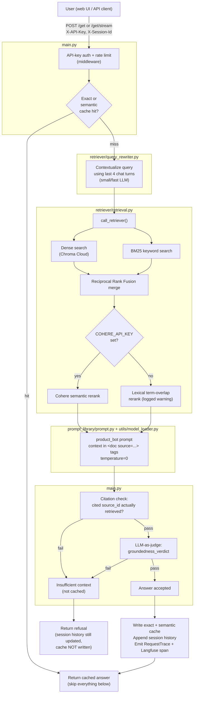

# Customer Support RAG System — Technical Summary

Single source of truth for this codebase: what it is, how a request flows through it end to end, every API surface, every config knob, and the reasoning behind the non-obvious decisions. Written to let someone with zero prior context become productive without re-deriving anything from the source.

Last updated: 2026-07-14, reflecting the state after a full day of live testing, bug fixes, and a latency hardening pass (see [Recent Hardening](#recent-hardening-2026-07-14) at the bottom).

---

## 1. What this is

A FastAPI-based e-commerce product-support chatbot. It answers questions about products using **retrieval-augmented generation (RAG)** over a corpus of product reviews (currently: 450 Flipkart reviews, ~542 chunks). It is not a general chatbot — it refuses to answer anything it cannot ground in retrieved evidence, on purpose.

Core design commitments, all visible directly in the code:

- **Grounded or silent.** Every factual claim must carry a `[source:ID]` citation. An answer that cites something it didn't retrieve, or that an LLM judge decides isn't actually supported by the context, gets replaced with a safe refusal — never a guess.
- **Multi-turn aware.** Follow-up questions ("what about a cheaper one?") get rewritten into standalone questions using recent chat history before retrieval runs.
- **Provider-agnostic.** LLM provider (Groq / Google Gemini / HuggingFace) and embedding provider are both swappable via config, with env-var overrides for the LLM side so you can hop providers mid-incident without a redeploy.
- **Degrades loudly, never silently.** Redis unavailable → in-memory fallback, logged. Cohere unavailable → lexical reranking, logged as a warning on every query. Langfuse unset → tracing becomes a no-op. Nothing silently produces degraded behavior without saying so in the logs.

---

## 2. Tech stack

| Layer | Choice | Notes |
|---|---|---|
| API framework | FastAPI + Uvicorn | Single process, `--reload` for dev |
| LLM (generation + query rewrite) | Groq (`llama-3.3-70b-versatile` / `llama-3.1-8b-instant`) | Swappable to Google Gemini or HuggingFace via `LLM_PROVIDER` env var |
| Embeddings | `sentence-transformers/all-MiniLM-L6-v2`, local (HuggingFace) | Runs on-box, zero API quota risk |
| Vector store | Chroma Cloud | No local fallback once cloud creds are set — see [§9](#9-vector-store--chroma) |
| Keyword search | BM25 (`rank_bm25`), JSON index in object storage | Runs alongside dense search, merged via RRF |
| Reranking | Cohere Rerank (`rerank-english-v3.0`), optional | Falls back to lexical term-overlap reranking if unset |
| Cache / sessions / rate limiting | Redis, in-memory fallback | `fakeredis` used for tests |
| Semantic cache gate | Cross-encoder NLI (`cross-encoder/nli-deberta-v3-small`), local | See [§8.3](#83-semantic-cache--the-nli-gate) — this is the most subtle piece of the whole system |
| Observability | Langfuse (v3+, OTel-based) + structured JSON request logs | Every request scored for citation/groundedness, not just eval runs |
| Evaluation | RAGAS (if installed) + a fast fallback, 12-case golden set | Gates CI on regression |
| Deployment target | GKE (Terraform-provisioned) | See [§12](#12-deployment) |

---

## 3. Architecture



### Text version (for a quick skim)

```
User
 -> FastAPI middleware: X-API-Key auth, per-identity rate limit
 -> Exact cache check (Redis, keyed on session_id + normalized raw query)
 -> Semantic cache check (cosine pre-filter -> NLI entailment gate)
      | hit -> return cached answer, skip everything below
      v miss
 -> Query rewrite (only if chat history exists): resolve pronouns/negation/
    multi-item references into a standalone question
 -> Hybrid retrieval: dense (Chroma) + BM25, run concurrently, merged by RRF
 -> Rerank: Cohere if configured, else lexical term-overlap fallback
 -> Generation: product_bot prompt, context as untrusted <doc> blocks,
    temperature=0, citation required
 -> Citation check -> Groundedness judge (LLM-as-judge)
      | either fails -> "Insufficient context" (never cached)
      v both pass
 -> Cache write (exact + semantic) + session history append
 -> RequestTrace JSON log + Langfuse span
 -> Response to user (plain text or SSE token stream)
```

---

## 4. Repository structure

```
main.py                        FastAPI app: routes, auth, the whole request pipeline
config/
  config.yaml                  Provider, retrieval, ingestion settings
  config_loader.py
retriever/
  retrieval.py                 Hybrid search, RRF, reranking, metadata filters
  query_rewriter.py            Multi-turn query contextualization
data_ingestion/
  ingestion_pipeline.py        Incremental ingest: land -> clean -> chunk -> dedupe -> embed
utils/
  model_loader.py               LLM/embedding provider loading + caching (groq/google/huggingface)
  chroma_utils.py                Chroma Cloud vs local persistence routing
  ops.py                         ResponseCache, RateLimiter, SessionStore (Redis-backed,
                                  in-memory fallback), request tracing, Langfuse wiring,
                                  NLI-gated semantic cache
  bm25_index.py                  BM25 index persistence
  object_store.py                Storage abstraction (local / gs:// / s3:// / abfs://)
  config_loader.py
prompt_library/
  prompt.py                     System prompts: generation, groundedness judge, query rewrite
evaluation/
  golden_test_set.py             12 labeled test cases
  evaluator.py                   Retrieval + generation metrics (RAGAS or fallback)
  run_evaluation.py              Runs golden set, gates CI on regression vs. baseline
tests/                          82 tests (fast, dependency-free, except test_phase4_ci.py
                                 which hits real providers)
templates/, static/             Web chat UI (vanilla HTML/JS, no framework)
deploy/k8s.yaml                 GKE Deployment/Service/HPA/SecretProviderClass manifest
.github/workflows/
  main.tf, variables.tf,
  backend.tf, outputs.tf         Terraform: GKE cluster, Artifact Registry, IAM,
                                  Workload Identity Federation for CI/CD
  deploy-to-gke.yml              Build + push + deploy pipeline
  evaluation.yml                 CI: runs tests + evaluation on every push
Dockerfile, docker-compose.yml  Container build + local compose (no local Redis by design)
```

---

## 5. API reference

All routes defined in `main.py`. Base URL in local dev: `http://localhost:8001`.

### Auth

Every request to `/get` and `/get/stream` must carry:

```
X-API-Key: <APP_API_KEY value>
```

Checked with `secrets.compare_digest` (timing-safe). Missing/wrong key → `401`. `APP_API_KEY` unset server-side → `503` (fails closed, not open). Also enforced: **per-identity rate limiting** (`RateLimiter`, keyed on the API key itself, or client IP if no key — default 30 requests / 60s window), returning `429` when exceeded.

### `GET /`
Renders the chat UI (`templates/chat.html`). No auth.

### `GET /health`
Liveness probe. Always `{"status": "healthy"}` if the process is up. No auth, no dependency checks — used as the Kubernetes `livenessProbe`.

### `GET /ready`
Readiness probe — actually checks dependencies: `APP_API_KEY` set, `GROQ_API_KEY` set, Chroma storage reachable/configured. Returns `503` if any check fails. Used as the Kubernetes `readinessProbe`.

```json
{"status": "ready", "checks": {"app_api_key": true, "groq_api_key": true, "chroma_storage": true}}
```

### `POST /get`
Single-turn or multi-turn (via `X-Session-Id`) chat, plain-text response.

**Headers:** `X-API-Key` (required), `X-Session-Id` (optional, defaults to `"default"` — see [Known limitation](#known-limitations) about the web UI not sending this).

**Body (form-encoded):** `msg` (string, 1-2000 chars).

```bash
curl -X POST http://localhost:8001/get \
  -H "X-API-Key: $APP_API_KEY" \
  -H "X-Session-Id: user-123" \
  --data-urlencode "msg=Can you recommend a good budget headphone?"
```

Response: the answer as plain text (may be the "Insufficient context..." refusal).

### `POST /get/stream`
Same request shape as `/get`, but Server-Sent Events (SSE) response — used by the web UI for token-by-token streaming.

**Event sequence:**
```
event: request_id
data: <uuid>

event: status
data: retrieving

event: cache
data: miss | exact | semantic

event: token
data: <word> 
... (repeated, one per whitespace-split word — NOT true incremental LLM
     streaming; the full answer is generated first, then replayed word by
     word for a typing-effect UI)

event: done
data: [DONE]
```

Note: `[DONE]` is sent regardless of success/refusal — a refusal is a normal, complete answer from the API's perspective, not an error.

---

## 6. Query flow, in detail

This is `main.py`'s `invoke_chain_details()` — the one function every request (streaming or not) funnels through.

1. **Trace + Langfuse span opened.** A `RequestTrace` object accumulates timing/metadata for the structured JSON log line emitted at the end. `build_langfuse_trace()` opens a matching span (no-op if Langfuse keys unset), with a trace ID deterministically derived from the request's own ID — so a log line and a Langfuse trace can always be cross-referenced.

2. **Query embedded** (`_embed_query`) — needed for the semantic cache check regardless of hit/miss. This is cached per-`ModelLoader`-instance (see [§10.1](#101-provider-client-caching)); it used to reconstruct the embedding model from scratch on every call.

3. **Exact cache check** (`ResponseCache.get_exact`) — keyed on `sha256(session_id + normalize(raw_query))`. Case/whitespace-insensitive, but otherwise requires the literal same text.

4. **Semantic cache check** (`ResponseCache.get_semantic`, only if exact missed) — see [§8.3](#83-semantic-cache--the-nli-gate) for why this is more than a similarity threshold.

5. **On any cache hit:** append to session history, log, return immediately. **Retrieval and generation are entirely skipped.**

6. **On a miss:** build chat history (`_build_chat_history`, last 4 turns, citations stripped — see [§7](#7-citation-stripping-in-chat-history) for why).

7. **Retrieval** (`retriever_obj.call_retriever`) — see [§8](#8-retrieval-in-detail).

8. **Generation** — `product_bot` prompt (see [§9.2](#92-the-generation-prompt)), `temperature=0`, context passed as `<doc source="ID">...</doc>` blocks.

9. **Guardrails, in order:**
   - If retrieval returned nothing → immediate refusal, no LLM guardrail calls needed.
   - **Citation check** (`_verify_citations`) — regex-extracts every `source:ID` token from the answer (not just whole `[...]` brackets — a model bundling multiple citations into one bracket, e.g. `[source:A, source:B]`, is handled) and checks each against the set of actually-retrieved source IDs. Any mismatch → refusal.
   - **Groundedness judge** (`_judge_groundedness`) — a separate LLM call, strict YES/NO, asks "is this answer actually supported by this context?" Independent of the citation check — an answer can cite real IDs but still misrepresent what they say.
   - Either check failing → the answer is replaced with one of two fixed refusal strings (`INSUFFICIENT_CONTEXT_NO_DOCS` / `INSUFFICIENT_CONTEXT_UNGROUNDED`), never the model's actual (possibly ungrounded) text.

10. **Cache write** — **only if the output is not a refusal.** A citation/groundedness failure is often transient (LLM sampling variance), so caching it would make the refusal "sticky" for the whole TTL, refusing a genuinely answerable question repeatedly until expiry.

11. **Session history append** — happens unconditionally (even for a refusal — the conversation did happen).

12. **Trace finished, Langfuse span closed** with `citation_check`/`groundedness` recorded as first-class Langfuse *scores* (chartable trend lines, not buried metadata).

---

## 7. Citation stripping in chat history

`_strip_citations()` removes `[source:ID]` markers before an answer is replayed into a *future* prompt as chat history. Without this, a weaker model tends to copy a source ID forward from a previous turn's answer and cite it against the *current* turn's freshly-retrieved (and likely different) context — a citation that looks fabricated and gets correctly rejected by `_verify_citations`, producing a false refusal on a question the model could otherwise answer fine purely from history.

---

## 8. Retrieval, in detail

`retriever/retrieval.py`'s `Retriever.call_retriever()`:

1. **Query rewrite** (`contextualize_query`, `retriever/query_rewriter.py`) — skipped entirely if there's no chat history yet (first turn). Uses a small/fast model (`llama-3.1-8b-instant` by default) with an explicit prompt contract:
   - Resolve pronouns/implicit references ("the cheaper one") using history.
   - **Preserve polarity exactly** — a negated follow-up ("do they sound bad?") must not get flipped positive just because prior history leaned positive. (Found and fixed 2026-07-14 — see [§13](#13-recent-hardening-2026-07-14).)
   - **Don't collapse an ambiguous singular reference onto one item** — "tell me more about it" after the assistant listed several distinct products should expand to name all of them, not silently pick the last one mentioned. (Also fixed 2026-07-14; known to still have a downstream retrieval-precision limitation — see [§14](#14-known-limitations--parked-work).)

2. **Lexical query expansion** (`rewrite_query`) — a fixed synonym table (`headphone` → `headphones earphones earbuds`, `budget` → `budget affordable cheap low cost`, etc.), applied to the rewritten query before search. Deliberately dumb/deterministic, not LLM-based.

3. **Metadata filter parsing** (`parse_metadata_filters`) — regex-extracts `field OP value` patterns like `rating>=4` from the *original* (not rewritten) query. Supported fields: `rating`, `price`, `category`, `product_name`, `brand`. **Only `rating` actually matches anything against the bundled demo dataset** — the CSV has no price/category/brand columns (see [Known limitations](#14-known-limitations--parked-work)).

4. **Hybrid search, run concurrently** (`ThreadPoolExecutor`, 2 workers):
   - **Dense**: Chroma similarity search via `retriever.invoke()`.
   - **Sparse**: BM25 keyword search (`utils/bm25_index.py`), index reloaded from storage at most every 60s (`BM25_REFRESH_SECONDS`) since it's rebuilt by the ingestion job, not this process.
   - Candidate pool size (`_candidate_pool_top_k`): 20 if Cohere reranking is active, 10 otherwise — a real semantic reranker benefits from more candidates; the crude lexical fallback reranker gets *worse* with more (more chances for an irrelevant-but-lexically-similar doc to outrank the genuinely relevant one).

5. **Metadata filters applied** to both result sets independently.

6. **Reciprocal Rank Fusion merge** (`rrf_merge`, k=60) — standard RRF scoring (`1/(k + rank + 1)` per list, summed), not a naive concatenation, so a document ranked highly in *both* dense and sparse search outranks one that only one method liked.

7. **Rerank** (`_rerank`):
   - Cohere Rerank if `COHERE_API_KEY` set (with an optional relevance-score floor).
   - Cohere call failing at runtime → caught, falls back to lexical.
   - No key at all → lexical term-overlap reranking (`rerank_documents`), logged as a **warning on every single query** so this degraded mode is never silent. Final count via `dynamic_top_k` (3/4/5 depending on candidate pool size).

---

## 9. Generation

### 9.1 Vector store: Chroma

`utils/chroma_utils.py`'s `create_chroma_store()`. Key decision: **once cloud credentials are configured, cloud is used unconditionally — there is no silent fallback to local storage on a cloud error.** A quota/timeout/auth failure surfaces as a loud `RuntimeError`, not a quiet fork into a second, divergent local index that only one replica can see. Local persistence (`chroma_db/` folder) is reached *only* when no cloud credentials exist anywhere and no explicit mode is set — logged as a warning so nobody mistakes it for the cloud store.

### 9.2 The generation prompt

`prompt_library/prompt.py`'s `product_bot` template:

- Context passed as `<doc source="ID">...</doc>` blocks, explicitly labeled **untrusted, not instructions** — a direct prompt-injection defense: review text is user-generated and could contain an embedded instruction ("ignore previous instructions and..."), and the prompt tells the model to treat it purely as evidence, never as directives, even if it claims to be from "the system."
- Every factual claim must carry a `[source:ID]` citation.
- Explicit instruction to say "Insufficient context" rather than guess.
- **Completeness instruction** (added 2026-07-14): when a follow-up asks to recall/list something from chat history, the model must account for *every* relevant item mentioned there, not just the most prominent one — direct fix for an observed bug where a 3-item recommendation got recalled as if it were 1-item.

### 9.3 Determinism

`ModelLoader.load_llm()` sets `temperature=0` across all three providers (Groq: `temperature=0`; Google: `temperature=0`; HuggingFace: `do_sample=False` — HF's TGI-based endpoints typically reject `temperature=0` outright, so greedy decoding is requested the correct way for that provider instead). Added 2026-07-14 after observing the same question asked twice in one session produce meaningfully different answers. **This tightens but does not fully eliminate variance** — retrieval became fully deterministic (identical `retrieved_source_ids` across repeats) but generation still shows minor differences occasionally, most likely because Groq's serving infrastructure uses continuous batching, and floating-point ops aren't strictly associative across different batch compositions — a ceiling on determinism inherent to any shared, high-throughput inference API, not fixable from this codebase.

---

## 10. Provider loading, caching, and quota management

`utils/model_loader.py`'s `ModelLoader` is the single point of LLM/embedding provider selection.

### 10.1 Provider client caching

**This was the single biggest latency bug found in this project.** `load_embeddings()` and `load_llm()` originally reconstructed their client objects from scratch on *every call* — for embeddings specifically, that meant reloading the full sentence-transformer model from disk into memory on every single chat request (measured: **5.6–7.4s per call**, vs. **~7ms** when reused). Both are now cached:

- `load_embeddings()` — cached as `self._embeddings`, a single instance per `ModelLoader` object.
- `load_llm()` — cached in `self._llm_cache`, keyed by `(provider, model_name)`, since the same instance is called with different models (main generation vs. groundedness judge vs. — in `Retriever` — the query-rewrite model).

Net effect: warm-request latency dropped roughly 4x (measured **7.9–8.5s → 2.0–2.1s**) in live testing.

### 10.2 Provider quick-switch

`LLM_PROVIDER` / `LLM_MODEL_NAME` / `LLM_REWRITE_MODEL_NAME` env vars take precedence over `config.yaml` whenever set — a one-line env change instead of an edit + redeploy when a provider's quota is hit mid-session. Embedding provider is **deliberately not** switchable this way: changing it means re-ingesting into a new Chroma collection (different embedding models = incompatible vector spaces), so that stays a considered `config.yaml` edit, not a quick env flip.

### 10.3 Provider quota realities (learned firsthand)

| Provider | Failure mode | Notes |
|---|---|---|
| Groq | Daily token cap (~100k TPD observed on `llama-3.3-70b-versatile`) | Resets on a fixed daily cycle, not rolling. Heavy automated testing burns through it fast. |
| Google (Gemini) | Free tier only if the API key's project has **no Cloud Billing account linked** | A billing-linked project draws from a separate "Prepay" balance; hitting $0 there gives a different, easy-to-miss `RESOURCE_EXHAUSTED` error. |
| HuggingFace | Small **monthly** credit pool via the serverless Inference router, separate from the other two | A single eval run against a 70B model can exhaust it. Embeddings via HF run **locally** (no API, no quota risk — the most robust of the three for that specific role). |

---

## 11. Caching architecture

`utils/ops.py`. Three independent Redis-backed subsystems, all with a graceful in-memory fallback (logged loudly) when `REDIS_URL` is unset.

### 11.1 SessionStore
Per-session chat history (`rag:session:{id}` list in Redis). `append()`/`get_recent(limit)`. Trimmed to `SESSION_MAX_TURNS` (default 20), expires after `SESSION_TTL_SECONDS` (default 86400). Only the last 4 turns are ever pulled into a prompt (`main.py:_build_chat_history`).

### 11.2 RateLimiter
Fixed-window counter (`rag:rate:{identity}`), default 30 requests / 60s. `INCR` + `EXPIRE` on first hit.

### 11.3 ResponseCache — exact match
`rag:exact:{sha256(session_id + normalized_query)}`, JSON payload, TTL = `CACHE_TTL_SECONDS` (default 3600). **Never written for a refusal answer** (fixed 2026-07-14 — see [§13](#13-recent-hardening-2026-07-14)).

### 11.4 ResponseCache — semantic match, and the NLI gate

This is the most non-obvious piece of engineering in the codebase, worth understanding in full.

**The naive version** (raw cosine similarity threshold) was tested live and found to have a serious correctness bug: on `all-MiniLM-L6-v2`, a genuine paraphrase ("sound quality" vs. "audio quality") scored **0.89** cosine similarity — while a **negated opposite** ("good battery life" vs. "poor battery life") scored **0.95–0.98**, *higher* than the real paraphrase. There is no single cosine threshold that accepts paraphrases while rejecting negated opposites — negation barely moves embedding space for this model class, a well-known limitation, not a tuning problem.

**The fix**, implemented in `utils/ops.py`:

1. `rag:semantic:index` (a Redis list, capped at `SEMANTIC_CACHE_MAX_ENTRIES`, session-scoped) stores each cached query's normalized text + embedding.
2. `get_semantic()` first does a **cheap cosine pre-filter** — `SEMANTIC_CACHE_CANDIDATE_THRESHOLD` (default `0.80`), just to shortlist candidates worth the more expensive check. This is *not* the hit decision.
3. Candidates are ranked by cosine descending; the top `SEMANTIC_CACHE_MAX_NLI_CHECKS` (default 5) are checked with `_is_paraphrase()` — a cross-encoder NLI model (`cross-encoder/nli-deberta-v3-small`, `SEMANTIC_CACHE_NLI_MODEL` env-overridable), run **bidirectionally**: entailment required forward (cached query → incoming), no contradiction required reverse. Both directions matter — on a tested negation pair, one direction alone gave a weak/ambiguous signal, but the other correctly flagged contradiction.
4. First candidate to pass wins. None pass → genuine cache miss, falls through to full retrieval+generation.
5. The NLI model itself is a **lazy-loaded module-level singleton** (`_get_nli_model()`) — loaded once per process (~5.3s, ~552MB on disk), not per call (~32ms per subsequent `_is_paraphrase()` call).

Cost profile: zero API/monetary cost (runs locally, same as embeddings), ~500MB-1GB additional RAM while loaded, negligible per-request latency once warm.

### 11.5 Langfuse client
`build_langfuse_trace()`/`finish_langfuse_trace()` — also fixed to a module-level singleton 2026-07-14 (was previously reconstructing the `Langfuse()` client, with its OTel exporter setup, on every request — measured ~5.9s, which was the dominant cost on a cache hit specifically, since everything else on that path is fast).

---

## 12. Deployment

- **Container**: `Dockerfile` — `python:3.12-slim`, non-root user, `HEALTHCHECK` against `/health`, CPU-only PyTorch wheel (avoids ~300MB of dead CUDA weight per image).
- **Local multi-container**: `docker-compose.yml` — app + an on-demand `ingest` one-shot job sharing volumes. Deliberately **no local Redis service** — `REDIS_URL` is expected to point at a real managed Redis even in this context.
- **Kubernetes** (`deploy/k8s.yaml`): Deployment (2-6 replicas via HPA on CPU), ClusterIP Service, a dedicated KSA linked to a GSA via Workload Identity, and a `SecretProviderClass` wiring GCP Secret Manager secrets (`app-api-key`, `groq-api-key`, `redis-host`, Chroma creds) into the pod. `readinessProbe` hits `/ready`, `livenessProbe` hits `/health`.
- **Infrastructure as code** (`.github/workflows/*.tf`, an unusual location for Terraform but that's where it lives in this repo): provisions GKE cluster (private nodes, Workload Identity enabled), Artifact Registry, service accounts, and GitHub Actions Workload Identity Federation (no long-lived service account keys in CI).
- **CI/CD** (`.github/workflows/deploy-to-gke.yml`): triggered after `evaluation.yml` (RAG Evaluation CI) succeeds on `main`. Auths via WIF, builds + pushes the image to Artifact Registry, runs a one-off data-ingestion Kubernetes Job, applies the manifest, rolls out the new image.
- **GCP resources encountered during testing (2026-07-14)**: a GKE cluster and a Memorystore Redis instance were found already provisioned outside Terraform (manual creation, `goog-terraform-provisioned=true` label present but not reflected in the local `terraform.tfstate`). The GKE cluster's deployment was broken (CSI Secrets Store driver name mismatch — the live pod requested `secrets-store.csi.k8s.io`, but this cluster only has `secrets-store-gke.csi.k8s.io` registered) and had been silently failing, burning cost, for 3+ days. **That cluster was torn down.** The Memorystore Redis instance was left running (private VPC IP, `10.31.153.131:6379`, `BASIC` tier, no AUTH, no TLS, no persistence — fine for dev/test, not for anything real) but not yet wired into the app; local testing today used a Docker Redis container instead, reachable without a VPC hop. **GCP deployment has not yet been (re-)done properly via Terraform** — this is the next planned step.

---

## 13. Recent hardening (2026-07-14)

A single day's live-testing session surfaced and fixed six distinct issues, in the order found:

1. **Semantic cache negation risk** — raw cosine similarity ranked negated-opposite questions above genuine paraphrases. Fixed with the NLI entailment gate (§11.4).
2. **Query-rewrite negation flip** — "do they sound bad?" got rewritten to "...good?" when prior chat history leaned positive. Fixed with an explicit polarity-preservation instruction + worked example in the rewrite prompt.
3. **Three separate per-request reconstruction bugs** — embeddings, LLM clients, and the Langfuse client were all being rebuilt from scratch on every single request instead of cached. Fixed via instance-level and module-level singletons. ~4x warm-request latency improvement.
4. **Sticky refusal caching** — a transient citation/groundedness failure got cached and kept refusing a genuinely answerable question for the full TTL window. Fixed by never caching a refusal answer.
5. **Incomplete recall** — "which ones did you just mention?" after a 3-item answer recalled only 1 item. Fixed with an explicit completeness instruction in the generation prompt.
6. **Ambiguous singular reference** — "tell me more about it" after listing 3 distinct products silently narrowed to the last one mentioned. Fixed in the rewrite prompt to expand to all named items — which in turn surfaced issue #14 below (parked, not yet fixed).

All changes are covered by the existing 82-test suite (all passing) plus 3 new/updated tests specifically covering the NLI-gate negation-rejection behavior.

---

## 14. Known limitations / parked work

- **Multi-item retrieval dilution** (found 2026-07-14, parked). Once a follow-up correctly expands to "tell me more about X, Y, and Z," a single combined retrieval query dilutes precision per item — the embedding for "X and Y and Z" retrieves well for whichever product dominates semantically, weakly for the others. The system's own citation/groundedness guardrails correctly refuse to fabricate on the under-retrieved items (safe failure mode) rather than hallucinate, but the answer is incomplete. A real fix means running a separate retrieval pass per named item and merging contexts — genuine architecture work, not a prompt tweak.
- **The web UI has no per-browser session ID.** `templates/chat.html` never sends `X-Session-Id`, so every browser tab defaults to `session_id="default"` server-side — concurrent web UI users currently share one global conversation. The API-level session isolation works correctly; the UI just doesn't exercise it.
- **Metadata filters for `price`/`category`/`brand` don't match anything** against the bundled demo dataset (the CSV only has `product_title`/`rating`/`summary`/`review`). `rating>=N` does work. This means the LLM occasionally answers from tangentially-related context on out-of-scope filter questions instead of refusing — correct grounded behavior given what's actually available, just not what a filter query implies.
- **GCP deployment**: see §12 — the previously-provisioned GKE cluster was broken and has been torn down; a clean Terraform-driven deployment is the next planned step, not yet done.

---

## 15. Testing & evaluation

- **`tests/`** — 82 tests, unittest-based, run via `python -m unittest discover tests -p "test_*.py" -v` or `pytest`. All fast and dependency-free (using `fakeredis` for real-Redis-semantics testing without a network dependency, and mocked LLM/NLI calls) except `test_phase4_ci.py`, which instantiates a real `Retriever()` and calls real providers — consumes live quota when run.
- **`evaluation/`** — a 12-case golden test set (`golden_test_set.py`) spanning recommendation, comparison, metadata-filter, out-of-scope, multi-turn, and prompt-injection cases. `evaluator.py` computes retrieval metrics (precision/recall/MRR) and generation metrics (faithfulness/relevance) — via RAGAS if installed and a reference answer is supplied, else a fast token-overlap fallback that still exercises the real production `_judge_groundedness` function (wired through by `run_evaluation.py`, not a weaker proxy). `run_evaluation.py` runs the full set end-to-end, writes `results.json`, and exits non-zero on regression vs. `baseline_results.json` — this is what gates the `evaluation.yml` CI workflow.

---

## 16. Best practices followed (checklist)

**Correctness / safety**
- ✅ Refuse rather than guess — citation check + LLM groundedness judge, both independent, either failing triggers a fixed safe-refusal string, never the model's raw (possibly wrong) output.
- ✅ Never cache a refusal — avoids amplifying a transient failure into a sticky wrong answer for the whole cache TTL.
- ✅ Semantic similarity gated by NLI entailment, not raw cosine — closes a real negation-confusion vulnerability rather than just tuning a threshold that couldn't actually solve it.
- ✅ Prompt-injection defense — retrieved content is explicitly wrapped and labeled as untrusted data, never instructions, directly in the generation prompt.
- ✅ `temperature=0` for reproducible answers to repeated questions.
- ✅ Timing-safe API key comparison (`secrets.compare_digest`), fails closed if the key is unconfigured.

**Reliability / degradation**
- ✅ Every external dependency (Redis, Cohere, Langfuse, Chroma Cloud) has a defined fallback behavior, and every fallback is **logged loudly**, never silent.
- ✅ Chroma: once cloud is configured, no silent fallback to a divergent local store on error — fails loud instead.
- ✅ Ingestion state persisted after every batch (not just at the end), so a transient failure mid-run only costs a retry of what's left, not a full re-run/re-bill.
- ✅ Incremental, idempotent ingestion (content-hash dedupe) — safe to re-run.

**Performance**
- ✅ Dense + sparse retrieval run concurrently (`ThreadPoolExecutor`), not sequentially.
- ✅ Expensive client objects (embedding model, LLM clients, NLI model, Langfuse client) are singletons, not reconstructed per request — found and fixed a ~4x latency regression from this exact anti-pattern in three separate places.
- ✅ Reranker candidate pool sized differently depending on whether a real semantic reranker is active (wider) vs. the lexical fallback (narrower, to avoid degrading further).

**Observability**
- ✅ Structured JSON request tracing (`RequestTrace`) on every request — not just eval runs — covering retrieval/generation latency, cache hit type, citation/groundedness verdicts.
- ✅ Langfuse traces cross-referenceable to log lines via a deterministic trace ID derived from the request ID.
- ✅ citation_check/groundedness recorded as first-class Langfuse **scores**, not buried in metadata — directly chartable as production trend lines.

**Engineering hygiene**
- ✅ Provider abstraction (LLM + embeddings) behind one loader, config-driven, env-override for fast incident response.
- ✅ Comprehensive, fast, dependency-free test suite (82 tests) using `fakeredis` and mocks to validate real command semantics without live network calls.
- ✅ Non-root Docker user, CPU-only PyTorch wheel to avoid shipping dead CUDA weight.
- ✅ Workload Identity Federation for CI/CD — no long-lived GCP service account keys stored in GitHub.
